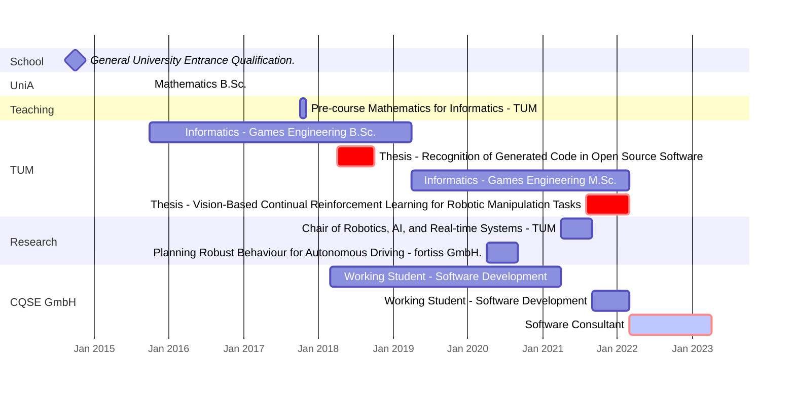

# Hi, welcome to my page!

I'm happy you found your way to my page.  
Let me know that you were here by using the links on the bottom of the side bar.

_Me, Marcel Bruckner_

```mermaid 
    gantt   
    dateFormat  MM-YYYY
    axisFormat  %b %Y
    section School
    General University Entrance Qualification. :milestone, 10-2014,
    section UniA
    Mathematics B.Sc. :unia, after school, 10-2015
    section Teaching
    Pre-course Mathematics for Informatics - TUM                    :tutor, 10-2017, 11-2017
    section TUM
    Informatics - Games Engineering B.Sc.                           :bsc,  after unia, 04-2019
    Thesis - Recognition of Generated Code in Open Source Software  :crit, bachelor-thesis, 04-2018, 10-2018
    Informatics - Games Engineering M.Sc.                           :msc,  after bsc, 03-2022
    Thesis - Vision-Based Continual Reinforcement Learning for Robotic Manipulation Tasks  :crit, thesis, 08-2021, 03-2022
    section Research
    Chair of Robotics, AI, and Real-time Systems - TUM               :providentia, 04-2021, 09-2021
    Planning Robust Behaviour for Autonomous Driving - fortiss GmbH. :fortiss, 04-2020, 09-2020
    section CQSE GmbH
    Working Student - Software Development :working-student-first, 03-2018, 04-2021
    Working Student - Software Development :working-student-second, 09-2021, 03-2022
    Software Consultant                    :active, crit, work, after msc, 400d
```

